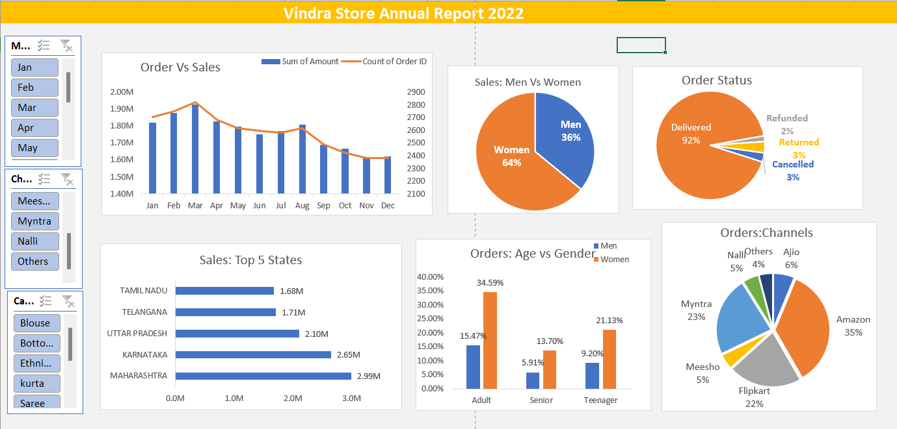

# Store Annual Sales Analysis (2023-2024)

## Project Overview
This project provides a comprehensive analysis of the annual sales performance for **Vrinda Store**. The objective was to transform raw sales data into actionable insights to help the store owner understand customer behavior and optimize marketing strategies for the upcoming year.

## Executive Summary
After processing and analyzing over the sales data, the analysis revealed that the core customer base is highly concentrated in specific demographics and regions. By focusing marketing efforts on these high-value segments, Vrinda Store can improve ROI on advertising spend and increase overall revenue.

## Key Insights
* **Gender Demographics:** Women are the primary drivers of sales, accounting for approximately **65%** of total purchases.
* **Geographic Hotspots:** Three states—**Maharashtra, Karnataka, and Uttar Pradesh**—contribute to **35%** of the total sales volume.
* **Age Segmentation:** The **Adult age group (30-49 years)** is the most significant contributor, responsible for nearly **80%** of the store's revenue.
* **Channel Performance:** Distribution is heavily reliant on e-commerce giants; **Amazon, Flipkart, and Myntra** combined account for **80%** of all orders.

---
### 1. Main Dashboard

## Technical Stack
* **Data Cleaning:** [e.g., MS Excel ]
* **Data Visualization:** [MS Excel]
* **Documentation:** Markdown

## Strategic Recommendations
Based on the data, the following growth strategy is recommended for the next fiscal year:

1.  **Hyper-Targeted Advertising:** Launch ad campaigns specifically designed for women aged 30-49.
2.  **Regional Focus:** Prioritize logistics and localized promotions in Maharashtra, Karnataka, and Uttar Pradesh.
3.  **Platform Optimization:** Focus inventory management and "Deal of the Day" participation on Amazon, Flipkart, and Myntra, as these platforms show the highest customer intent.
4.  **Retention Offers:** Use personalized coupons and discount codes tailored to the "Adult" demographic to increase customer lifetime value (LTV).

---

## Final Conclusion
To maximize sales, **Vrinda Store should target women in the 30-49 age bracket residing in Maharashtra, Karnataka, and Uttar Pradesh.** Marketing efforts should be concentrated on **Amazon, Flipkart, and Myntra** through targeted ads, exclusive offers, and digital coupons.

---

Do you need help with the specific DAX measures or Excel formulas used to calculate these percentages?

